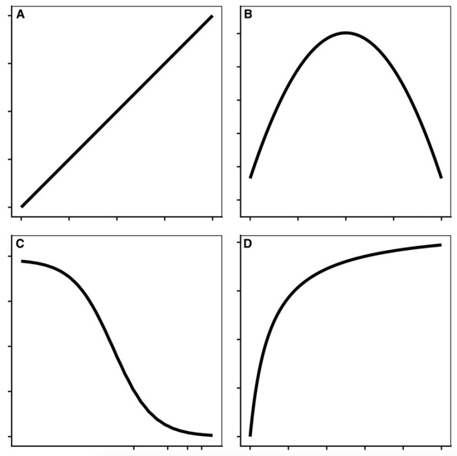
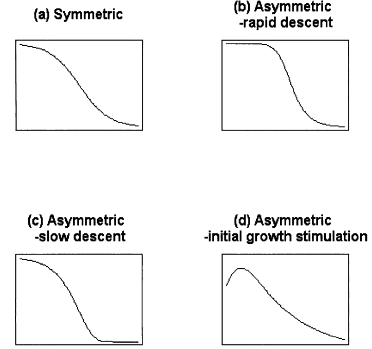
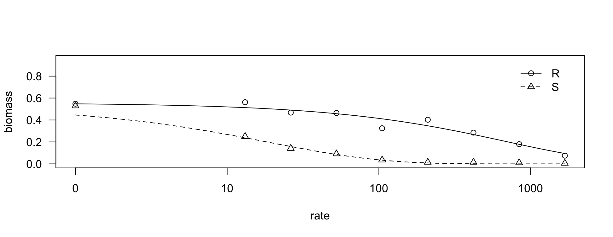

```{r include=FALSE}
library(drc)
library(tidyverse)
library(leaflet)
library(leaflet.providers)
library(leaflet.extras)
library(icons)
library(tidyUSDA)
library(plotly)
library(countdown)

# to read https://www150.statcan.gc.ca/n1/pub/95-640-x/2016001/article/14804-eng.htm
# https://www.thecanadianencyclopedia.ca/en/article/agriculture-in-canada#:~:text=Among%20Canada's%20top%20agricultural%20products,agricultural%20products%20in%20the%20world.
```

```{r xaringan-themer, include=FALSE, warning=FALSE}
library(xaringanthemer)
style_duo_accent(
  primary_color = "#1E4D2B",
  title_slide_background_color= "#1E4D2B",
  background_color = "#FFFFFF",
  secondary_color = "#ECC530",
  inverse_header_color = "#59595B"
)
```

```{r setup, include=FALSE}
options(htmltools.dir.version = FALSE)
knitr::opts_chunk$set(
  fig.width=9, fig.height=3.5, fig.retina=3,
  out.width = "100%",
  cache = FALSE,
  echo = TRUE,
  message = FALSE, 
  warning = FALSE,
  hiline = TRUE
)
```


class: middle, center

## Maxwel Coura Oliveira


[`r icon_style(fontawesome("github"), style = "solid")` @maxwelco](https://github.com/maxwelco)  
[`r icon_style(fontawesome("twitter"), style = "solid")` @maxwelco](https://twitter.com/maxwelco)  
[`r icon_style(fontawesome("link"), style = "solid")` maxweeds.rbind.io](https://maxweeds.rbind.io)  
[`r icon_style(fontawesome("envelope-square"), style = "solid")` maxwelco@gmail.com](mailto:maxwelco@gmail.com)

???

- I am on the social media. Please fee free to follow me

- Describe my social media

- My blog, github, twitter

---

```{r features, include=FALSE, warning=FALSE}
xaringanExtra::use_search(show_icon = TRUE,
                          position = "top-left")
xaringanExtra::use_webcam()
#xaringanExtra::use_freezeframe()
xaringanExtra::use_tile_view() # use letter O
xaringanExtra::use_share_again()
xaringanExtra::use_scribble() # use letter S
xaringanExtra::use_fit_screen()
xaringanExtra::use_broadcast() # use P
xaringanExtra::use_panelset()
```


## Announcements


- Read Knezevic et al. (2007) - Utilizing R Software Package for Dose-Response Studies:
 The Concept and Data Analysis

- Homework #2 due tomorrow (04/27/2022)

- Lab this week: Grass weed identification 

---

background-image: url(https://source.unsplash.com/erxoxRcdMQA)
background-position: right
background-size: contain

## Agenda


- History of dose response

- Definition and uses
  
- Curve
  
- Parameters

- Data points

- Analysis and interpretation


.footnote[Image: Jessica Fadel/Unsplash]


---

background-image: url(https://upload.wikimedia.org/wikipedia/commons/thumb/2/25/Aureolus_Theophrastus_Bombastus_von_Hohenheim_%28Paracelsus%29._Wellcome_V0004455.jpg/440px-Aureolus_Theophrastus_Bombastus_von_Hohenheim_%28Paracelsus%29._Wellcome_V0004455.jpg)
background-position: right
background-size: contain

## Philippus Aureolus <br>Theophrastus <br>Bombastus von Hohenheim

#### (1493 – 24 September 1541)

--

> Alle Ding sind Gifft und nichts ohn Gifft. <br>Allein die
 Dosis macht das ein Ding kein Gifft ist 
<br>

--

<br>
> All things are poison and are not poison; <br>only the dose makes a thing not a poison 

--


**Paracelsus**, the "father of toxicology"


.footnote[Image: Wikipedia]

---

## Dose response

#### Definition

> The dose–response relationship describes the magnitude of the response of an organism, as a function of exposure (or doses) to a stimulus or stressor (usually a chemical) after a certain exposure time

--

#### Applications

- Toxicology

- Pharmacology and drug development

- Epidemiology

- Biology
    - Weed research


---

## Dose response 

#### Weed research

.pull-left[
- Response of weeds and crops to physical, chemical, biological, or temporal stimuli
  - **Herbicide dose response**
  - Critical time for weed control
  - Cumulative weed germination  


- Summaries of biological assays require the use
 of **nonlinear regression** models with upper and lower limits,
 which provide information on the dose required to control the
 plant species of interest
]

.pull-right[
<center>

</center>
]

.footnote[Image: [agsci.colostate.edu/weedscience](https://agsci.colostate.edu/weedscience/pictures/)]


---

## Dose response curve

> A **dose–response curve** is a coordinate graph relating the magnitude of a dose (stimulus) to the response of a biological system

--

#### Which curve best describes a dose response relationship?

<center>

</center>


```{r echo = FALSE}
countdown(minutes = 0, seconds = 30)
```

---

## Dose response curve

#### Equation

The most commonly used model for sigmoidal dose-response curves is the log-logistic model with 3 - 4 parameters

<br>

.pull-left[

$$
Y = c + \frac{d-c}{1 + exp[b(logx - loge)]}
$$
]

.pull-right[
- Upper limit, d

- Lower limit, c

- Inflection point, e

- Slope, b
]


---

## Dose response curve

.pull-left[
#### Parameters

- Upper limit, d

- Lower limit, c

- Inflection point, e

- Slope, b
]


.pull-right[
```{r message = FALSE, warning = FALSE, echo = FALSE, fig.align='center', out.width='70%', fig.height = 6, fig.width = 6}
dose <- 1:2
resp <- rnorm(length(dose))
# no need to set the seed for the random number generation!
m <- drm(resp ~ dose, fct = LL.5())
plot(m)
```
]


---

## Dose response curve

<center>

</center>

.footnote[Source: Knezevic et al. 2007]

---

## Typical data variables

- Plant biomass (g) or relative biomass (%)

- % of weed control

- Herbicide dose (g ha<sup>-1</sup> or L ha<sup>-1</sup>)

--

<br><br>

#### What is the best variable for describing dose response studies?

A) weight, g

B) percent, %

```{r echo = FALSE}
countdown(minutes = 0, seconds = 30)
```

---

## Number of data points

- The shape of the dose response curve is influenced by the distribution of the data it describes

- Selection of herbicide doses is critical

```{r message = FALSE, warning = FALSE, echo = FALSE, fig.align='center', out.width='40%', fig.height = 6, fig.width = 6}
dose <- 1:2
resp <- rnorm(length(dose))
# no need to set the seed for the random number generation!
m <- drm(resp ~ dose, fct = LL.5())
plot(m)
```

---

## Dose response analysis

.panelset[
.panel[.panel-name[Dataset]
```{r}
library(RCurl)
library(tidyverse)
df_path <- getURL("https://raw.githubusercontent.com/maxwelco/workshop-esalq/main/data/dose_resposta.csv")

dose <- read_csv(df_path)
dose
```
]


.panel[.panel-name[Model and parameters]


```{r}
model <- drm(biomass ~ # response variable
               rate, # explanatory variable
             biotype, # treatments
             fct = W1.3(), # equation
             data = dose) # datase
summary(model)
plot(model)
```

]
.panel[.panel-name[Plot]
<center>

</center>
]

]


---

## Take home message

- Dose response relationship is best describe with a sigmoid curve and log-logistic models

- Selection of herbicide doses is critical

- Dose response uses in herbicide-weed research
    - Herbicide efficacy
    
    - Herbicide resistance
    
    - Crop tolerance

- Model parameters should have biological meaning

- Dose response can be performed using **R**, SAS or other statistical software


---

name: goodbye
class: right, middle, blue


# Thank you!

#### You can find me at...

[`r icon_style(fontawesome("github"), style = "solid")` @maxwelco](https://github.com/maxwelco)  
[`r icon_style(fontawesome("twitter"), style = "solid")` @maxwelco](https://twitter.com/maxwelco)  
[`r icon_style(fontawesome("link"), style = "solid")` maxweeds.rbind.io](https://maxweeds.rbind.io)  
[`r icon_style(fontawesome("envelope-square"), style = "solid")` maxwelco@gmail.com](mailto:maxwelco@gmail.com)


